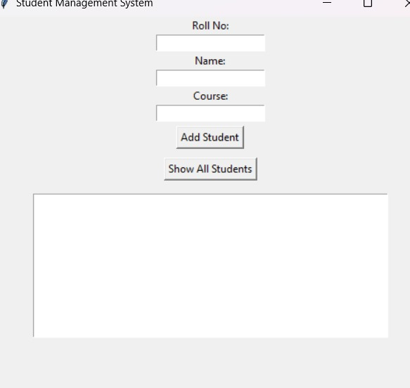

# 🎓 Student Management System (Python GUI + JSON)

This is a GUI-based student management system made using Python and Tkinter. It allows you to add, view, update, and delete student records.

## ✅ Features
- Add new student            ## 🖼️ Screenshot



- View all records
- Update and delete
- Stores data in JSON file

## ▶️ How to Run
```bash
python sstudent_gui.py
